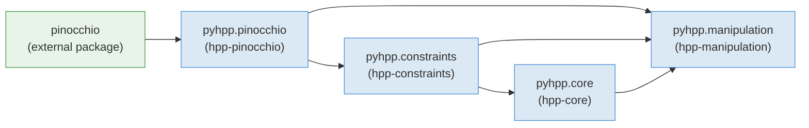

# hpp-python

[](https://gitlab.laas.fr/humanoid-path-planner/hpp-python/commits/master)
[](https://gepettoweb.laas.fr/doc/humanoid-path-planner/hpp-python/master/coverage/)
[](https://github.com/psf/black)

`hpp-python` provides native Python bindings for the [HPP](https://github.com/humanoid-path-planner/hpp-doc) (Humanoid Path Planner) C++ libraries (`hpp-core`, `hpp-constraints`, `hpp-pinocchio`, `hpp-manipulation`, ...), generated with [`boost::python`](https://www.boost.org/doc/libs/release/libs/python/). These bindings differ from the ones provided by `hpp-corbaserver`: they are **native, in-process bindings that do not use a CORBA middleware**, so there is no client/server split and no serialization overhead.

The resulting `pyhpp` package mirrors the C++ namespace layout:

- **`pyhpp.pinocchio`** — robot model (`Device`), grippers, Lie-group utilities. Wraps `hpp-pinocchio`.
- **`pyhpp.constraints`** — differentiable functions, transformations, implicit/explicit constraints, the hierarchical iterative solver. Wraps `hpp-constraints`.
- **`pyhpp.core`** — planning problem, path planners, path optimizers, path validation, roadmap, steering methods. Wraps `hpp-core`.
- **`pyhpp.manipulation`** — manipulation-specific `Device`, constraint graph, path planners/optimizers for manipulation problems, URDF/SRDF loading. Wraps `hpp-manipulation` and `hpp-manipulation-urdf`.
- **`pyhpp.tools`** — pure-Python helpers (xacro processing, constraint-error reporting) that are not generated bindings.

## Table of contents

- [Package layout](#package-layout)
- [Module dependency graph](#module-dependency-graph)
- [Dependencies](#dependencies)
- [Installation](#installation)
  - [From source with CMake](#from-source-with-cmake)
  - [With Nix](#with-nix)
- [Usage](#usage)
  - [Building a robot and a problem (`pyhpp.pinocchio` / `pyhpp.core`)](#building-a-robot-and-a-problem-pyhpppinocchio--pyhppcore)
  - [Constraints (`pyhpp.constraints`)](#constraints-pyhppconstraints)
  - [Manipulation problems (`pyhpp.manipulation`)](#manipulation-problems-pyhppmanipulation)
  - [Diagnosing constraint errors (`pyhpp.tools`)](#diagnosing-constraint-errors-pyhpptools)
- [Tests](#tests)
- [Documentation generation](#documentation-generation)
- [License](#license)

## Package layout

```
hpp-python/
├── CMakeLists.txt          # C++/CMake build (bindings + headers + Python stub generation)
├── package.xml             # ROS package manifest
├── flake.nix               # Nix flake (build via github:gepetto/nix)
├── include/pyhpp/          # C++ headers shared by the binding translation units
├── doc/
│   ├── configure.py            # Injects Doxygen-extracted docstrings into the .cc binding sources
│   ├── doxygen_xml_parser.py   # Parses Doxygen XML to feed configure.py
│   ├── core_doc_todo.md        # Docstring coverage status for pyhpp.core bindings
│   ├── constraints_doc_todo.md # Docstring coverage status for pyhpp.constraints bindings
│   └── manipulation_doc_todo.md # Docstring coverage status for pyhpp.manipulation bindings
├── src/pyhpp/
│   ├── __init__.py             # Top-level package init (imports eigenpy, silences converter warnings)
│   ├── pinocchio/              # hpp-pinocchio bindings: Device, Gripper, Lie-group utilities
│   │   ├── bindings.cc, device.cc/.hh, liegroup.cc, urdf/
│   │   └── utils.py                # shrinkJointRange() and other pure-Python helpers
│   ├── constraints/             # hpp-constraints bindings
│   │   ├── bindings.cc, differentiable-function.cc, generic-transformation.cc,
│   │   │   implicit.cc, explicit.cc, explicit-constraint-set.cc, locked-joint.cc,
│   │   │   iterative-solver.cc, by-substitution.cc, relative-com.cc
│   ├── core/                    # hpp-core bindings
│   │   ├── bindings.cc, problem.cc, path.cc, path-planner.cc, path-optimizer.cc,
│   │   │   path-projector.cc, path-validation.cc, roadmap.cc, steering-method.cc,
│   │   │   config-validation.cc, configuration-shooter.cc, constraint.cc,
│   │   │   connected-component.cc, distance.cc, node.cc, parameter.cc, reports.cc,
│   │   │   problem-target.cc
│   │   ├── path/                   # concrete Path subclasses submodule
│   │   ├── path_optimization/      # concrete PathOptimizer subclasses submodule
│   │   ├── problem_target/         # concrete ProblemTarget subclasses submodule
│   │   └── static_stability_constraint_factory.py
│   ├── manipulation/            # hpp-manipulation(-urdf) bindings
│   │   ├── bindings.cc, device.cc/.hh, graph.cc/.hh, problem.cc/.hh,
│   │   │   path-planner.cc/.hh, path-optimizer.cc, path-projector.cc,
│   │   │   steering-method.cc/.hh
│   │   ├── steering_method/        # e.g. cartesian.cc submodule
│   │   ├── urdf/                   # URDF/SRDF loading submodule
│   │   ├── constraint_graph_factory.py   # ConstraintGraphFactory: build constraint graphs declaratively
│   │   └── security_margins.py           # SecurityMargins: per-pair collision security margins
│   └── tools/                   # Pure-Python helpers, no C++ bindings
│       ├── xacro.py                # process_xacro(): resolve xacro files (with ROS 2 AMENT_PREFIX_PATH support)
│       └── constraint_error.py     # describe_error(): human-readable constraint violation report
└── tests/
    ├── unit/                    # unittest-based tests, one file per bound module (see below)
    └── integration/             # End-to-end scenarios (pr2-in-iai-kitchen, romeo-placard, ur3-spheres, ...)
```

## Module dependency graph

The `BOOST_PYTHON_MODULE` initializers `import` each other in a fixed order, which also reflects the underlying C++ library dependencies:



Importing `pyhpp.manipulation` transitively imports `pyhpp.core`, `pyhpp.constraints` and `pyhpp.pinocchio`; you rarely need to import the lower-level modules explicitly unless you only need robot/constraint primitives without a full manipulation problem.

## Dependencies

- Python ≥ 3.9, with `numpy`
- [Boost.Python](https://www.boost.org/doc/libs/release/libs/python/) (found via `search_for_boost_python()`)
- [`eigenpy`](https://github.com/stack-of-tasks/eigenpy)
- [Pinocchio](https://github.com/stack-of-tasks/pinocchio) (C++ and Python)
- HPP C++ libraries: `hpp-util`, `hpp-pinocchio`, `hpp-constraints`, `hpp-core`, `hpp-manipulation`, `hpp-manipulation-urdf`
- Optional: [`pybind11-stubgen`](https://github.com/sizmailov/pybind11-stubgen) to generate `.pyi` type stubs (`GENERATE_PYTHON_STUBS`, default `ON`)
- For running the test suite (`BUILD_TESTING`): [`example-robot-data`](https://github.com/Gepetto/example-robot-data), `hpp-environments`

## Installation

### From source with CMake

```bash
git clone --recursive https://github.com/humanoid-path-planner/hpp-python.git
mkdir hpp-python/build
cd hpp-python/build
cmake -DCMAKE_INSTALL_PREFIX=<your_install_prefix> -DCMAKE_BUILD_TYPE=Release ..
make
make test
make install
```

Relevant CMake options:

- `GENERATE_PYTHON_STUBS` (default `ON`): generate `.pyi` stub files with `pybind11-stubgen` for IDE autocompletion; automatically disabled if the tool is not found.
- `HPP_DEBUG` (default `OFF`): enable `hpp-util` debug logging (`-DHPP_DEBUG`).
- `HPP_BENCHMARK` (default `OFF`): enable `hpp-util` benchmark output (`-DHPP_ENABLE_BENCHMARK`).
- `BUILD_TESTING`: build and run the unit/integration test suite (requires `example-robot-data` and `hpp-environments`).

### With Nix

A flake is provided, pulling `hpp-constraints`, `hpp-core` and `hpp-manipulation` from their own flakes and building against [`github:gepetto/nix`](https://github.com/gepetto/nix):

```bash
nix build github:humanoid-path-planner/hpp-python
```

## Usage

### Building a robot and a problem (`pyhpp.pinocchio` / `pyhpp.core`)

```python
from pinocchio import SE3
from pyhpp.pinocchio import Device, urdf
from pyhpp.core import Problem

UR5_URDF = "package://example-robot-data/robots/ur_description/urdf/ur5_joint_limited_robot.urdf"
UR5_SRDF = "package://example-robot-data/robots/ur_description/srdf/ur5_joint_limited_robot.srdf"

robot = Device("ur5")
urdf.loadModel(robot, 0, "ur5", "anchor", UR5_URDF, UR5_SRDF, SE3.Identity())

problem = Problem(robot)
sm = problem.steeringMethod()
distance = problem.distance()
shooter = problem.configurationShooter()
```

Path planners, path optimizers, path validation and the roadmap are all bound in `pyhpp.core`, with concrete implementations exposed through the `pyhpp.core.path`, `pyhpp.core.path_optimization` and `pyhpp.core.problem_target` submodules.

### Constraints (`pyhpp.constraints`)

```python
from pyhpp.constraints import (
    Transformation,
    ComparisonTypes,
    ComparisonType,
    Implicit,
    LockedJoint,
)

# A 6D relative-transformation function between two frames, turned into an
# implicit equality constraint on the robot's configuration space.
function = Transformation.create("placement", robot, joint, frame_in_joint, target)
constraint = Implicit.create(
    function, ComparisonTypes([ComparisonType.Equality] * 6)
)
```

The hierarchical iterative solver (`ExplicitConstraintSet`, `HierarchicalIterativeSolver`, `BySubstitution`) lets you compose several `Implicit`/`Explicit` constraints and project configurations onto the resulting manifold.

`pyhpp.core.static_stability_constraint_factory.StaticStabilityConstraintsFactory` builds static-stability constraints (e.g. for legged or manipulation problems) on top of these primitives.

### Manipulation problems (`pyhpp.manipulation`)

```python
from pyhpp.manipulation import Device, Graph, Problem, urdf, ManipulationPlanner
from pyhpp.manipulation.constraint_graph_factory import ConstraintGraphFactory
from pyhpp.manipulation.security_margins import SecurityMargins

robot = Device("ur3-and-objects")
urdf.loadModel(robot, 0, "ur3", "anchor", UR3_URDF, UR3_SRDF, SE3.Identity())
# ... load additional robots / objects into the same Device ...

problem = Problem(robot)
graph = Graph("graph", problem)

factory = ConstraintGraphFactory(graph)
factory.setGrippers(["ur3/gripper"])
factory.setObjects(["sphere"], [["sphere/handle"]], [[]])
factory.generate()

margins = SecurityMargins(problem, factory, robotsAndObjects, robot)
margins.setSecurityMarginBetween("ur3", "sphere", 0.01)
margins.apply()

planner = ManipulationPlanner(problem, problem.roadmap())
```

`ConstraintGraphFactory` builds a constraint graph (nodes, edges, grippers, handles) declaratively from lists of grippers and objects, instead of assembling `Graph`/`Implicit`/`LockedJoint` objects by hand. `SecurityMargins` then lets you set per-pair collision security margins across the whole graph in one call.

### Diagnosing constraint errors (`pyhpp.tools`)

```python
from pyhpp.tools.constraint_error import describe_error

entries, satisfied = describe_error(config_projector, q)
for entry in entries:
    status = "OK" if entry["satisfied"] else "FAILED"
    print(f"{entry['name']} ({entry['kind']}): |error| = {entry['norm']:.3g} [{status}]")
```

`pyhpp.tools.xacro.process_xacro(*args)` resolves a xacro file into a URDF string, transparently picking up ROS 2 resource paths from `AMENT_PREFIX_PATH` when available.

## Tests

Unit tests (`tests/unit/`) use Python's built-in `unittest` framework, with shared robot/problem fixtures in `tests/unit/conftest.py` (`create_ur5_problem`, `create_ur3_robot`, ...). One test file typically covers one bound module: `test_problem.py`, `test_path_planner.py`, `test_path_optimizer.py`, `test_path_projector.py`, `test_path_validation.py`, `test_steering_method.py`, `test_configuration_shooter.py`, `test_constraint_factory.py`, `test_constraint_graph_factory.py`, `test_security_margins.py`, `test_static_stability.py`, `test_device.py`, `test_handles_grippers.py`, `test_liegroup.py`, `test_differentiable_function.py`, `test_position_constraint.py`, `test_roadmap.py`.

Integration tests (`tests/integration/`) run complete planning scenarios end to end, e.g. `pr2-in-iai-kitchen.py`, `romeo-placard.py`, `ur3-spheres.py` / `ur3-spheres-spf.py`, and `construction-set-m-rrt.py`, plus `test_benchmarks.py` / `benchmark_utils.py` for timing-oriented benchmarks.

Run them via CMake (`make test`, requires `BUILD_TESTING=ON`) or directly with `pytest`/`unittest` once the package is on your `PYTHONPATH`.

## Documentation generation

Doxygen comments in the upstream C++ libraries can be injected into the Python docstrings exposed by these bindings:

1. In every dependency's `doc/Doxyfile.extra.in`, set `GENERATE_XML=YES`.
2. Install the generated XML documentation from each dependency's `CMakeLists.txt`:
   ```cmake
   IF(_INSTALL_DOC)
     INSTALL(DIRECTORY ${CMAKE_CURRENT_BINARY_DIR}/doc/doxygen-xml
       DESTINATION ${CMAKE_INSTALL_DOCDIR})
   ENDIF()
   ```
3. `doc/configure.py` then reads that XML (via `doc/doxygen_xml_parser.py`) and rewrites special in-place comments in the `.cc` binding sources:
   - `DocNamespace(namespace)` sets the current C++ namespace (mapped to a Python package via `nsToPackage`).
   - `DocClass(classname)` sets the current class being documented.
   - `DocClassMethod(methodname, classname=None)` is replaced by the corresponding Doxygen-extracted docstring.

See the header comment of `doc/configure.py` for the full syntax and a worked example.

For binding methods that have no upstream `///` Doxygen comment (Python-only wrappers, modified signatures that hide output parameters, etc.), docstrings are written directly in the `.cc` binding source using `const char*` constants in an anonymous namespace placed before `namespace pyhpp {`:

```cpp
namespace {
const char* DOC_MY_METHOD = "Describe what the method does from the Python caller's perspective.";
}  // namespace

namespace pyhpp {
  // ...
  .def("myMethod", &MyClass::myMethod, DOC_MY_METHOD)
```

The documentation coverage for each module is tracked in `doc/core_doc_todo.md`, `doc/constraints_doc_todo.md` and `doc/manipulation_doc_todo.md`, using a `✅ / ❌ / ⚠️` legend per method.

> **TODO** (tracked in the source): use Doxygen to generate XML documentation of the headers included by a given binding file, then use that generated XML to auto-update the documentation comments in `src/pyhpp` (Doxygen's `INCLUDE_PATH` / `SEARCH_INCLUDES` options may help here).

## License

`hpp-python` is released under the [BSD 2-Clause License](LICENSE), Copyright (c) 2018-2025, CNRS.
