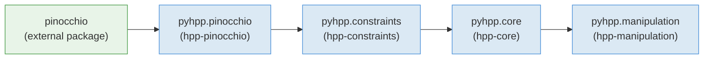

# hpp-python

[](https://gitlab.laas.fr/humanoid-path-planner/hpp-python/commits/master)
[](https://gepettoweb.laas.fr/doc/humanoid-path-planner/hpp-python/master/coverage/)
[](https://github.com/psf/black)

`hpp-python` provides native Python bindings for the [HPP](https://github.com/humanoid-path-planner/hpp-doc) (Humanoid Path Planner) C++ libraries (`hpp-core`, `hpp-constraints`, `hpp-pinocchio`, `hpp-manipulation`, ...), generated with [`boost::python`](https://www.boost.org/doc/libs/release/libs/python/). These bindings differ from the ones provided by `hpp-corbaserver`: they are **native, in-process bindings that do not use a CORBA middleware**, so there is no client/server split and no serialization overhead.

The resulting `pyhpp` package mirrors the C++ namespace layout:

- **`pyhpp.pinocchio`** — robot model (`Device`), grippers, Lie-group utilities. Wraps `hpp-pinocchio`.
- **`pyhpp.constraints`** — differentiable functions, transformations, implicit/explicit constraints, the hierarchical iterative solver. Wraps `hpp-constraints`.
- **`pyhpp.core`** — planning problem, path planners, path optimizers, path validation, roadmap, steering methods. Wraps `hpp-core`.
- **`pyhpp.manipulation`** — manipulation-specific `Device`, constraint graph, path planners/optimizers for manipulation problems, URDF/SRDF loading. Wraps `hpp-manipulation` and `hpp-manipulation-urdf`.
- **`pyhpp.tools`** — pure-Python helpers (xacro processing, constraint-error reporting) that are not generated bindings.

## Table of contents

- [Module dependency graph](#module-dependency-graph)
- [Dependencies](#dependencies)
- [Installation](#installation)
  - [From source with CMake](#from-source-with-cmake)
  - [With Nix](#with-nix)
- [Documentation generation](#documentation-generation)
  - [Injecting Doxygen docstrings into bindings](#injecting-doxygen-docstrings-into-bindings)
  - [API reference from stubs](#api-reference-from-stubs)
- [License](#license)


## Module dependency graph

The `BOOST_PYTHON_MODULE` initializers `import` each other in a fixed order, which also reflects the underlying C++ library dependencies:



## Dependencies

- Python ≥ 3.9, with `numpy`
- [Boost.Python](https://www.boost.org/doc/libs/release/libs/python/) (found via `search_for_boost_python()`)
- [`eigenpy`](https://github.com/stack-of-tasks/eigenpy)
- [Pinocchio](https://github.com/stack-of-tasks/pinocchio) (C++ and Python)
- HPP C++ libraries: `hpp-util`, `hpp-pinocchio`, `hpp-constraints`, `hpp-core`, `hpp-manipulation`, `hpp-manipulation-urdf`
- Optional: [`pybind11-stubgen`](https://github.com/sizmailov/pybind11-stubgen) to generate `.pyi` type stubs (`GENERATE_PYTHON_STUBS`, default `ON`)
- For running the test suite (`BUILD_TESTING`): [`example-robot-data`](https://github.com/Gepetto/example-robot-data), `hpp-environments`

## Installation

### From source with CMake

```bash
git clone --recursive https://github.com/humanoid-path-planner/hpp-python.git
mkdir hpp-python/build
cd hpp-python/build
cmake -DCMAKE_INSTALL_PREFIX=<your_install_prefix> -DCMAKE_BUILD_TYPE=Release ..
make
make test
make install
```

Relevant CMake options:

- `GENERATE_PYTHON_STUBS` (default `ON`): generate `.pyi` stub files with `pybind11-stubgen` for IDE autocompletion; automatically disabled if the tool is not found.
- `HPP_DEBUG` (default `OFF`): enable `hpp-util` debug logging (`-DHPP_DEBUG`).
- `HPP_BENCHMARK` (default `OFF`): enable `hpp-util` benchmark output (`-DHPP_ENABLE_BENCHMARK`).
- `BUILD_TESTING`: build and run the unit/integration test suite (requires `example-robot-data` and `hpp-environments`).

### With Nix

A flake is provided, pulling `hpp-constraints`, `hpp-core` and `hpp-manipulation` from their own flakes and building against [`github:gepetto/nix`](https://github.com/gepetto/nix):

```bash
nix build github:humanoid-path-planner/hpp-python
```

## Documentation generation

### Injecting Doxygen docstrings into bindings

Script `doc/configure.py` is used to generate documentation of Python objects from C++ objects.
It reads the XML documentation generated by doxygen so the dependencies must provide such
files. To make it work, do:
- Add `GENERATE_XML=YES` into `doc/Doxyfile.extra.in` of all the dependency of this project.
- Install the generated documentation by adding the following lines to `CMakeLists.txt`:
```cmake
IF(_INSTALL_DOC)
  INSTALL(DIRECTORY ${CMAKE_CURRENT_BINARY_DIR}/doc/doxygen-xml
    DESTINATION ${CMAKE_INSTALL_DOCDIR})
ENDIF()
```

File `doc/configure.py` contains a short documentation of how to document the bindings.

### API reference from stubs

After building and installing `pyhpp`, `pybind11-stubgen` produces `.pyi` stub files under the Python site-packages directory.

**`doc/fix_stubs.py`** improves those raw Boost.Python stubs in-place by recovering proper parameter names, types, and return-type annotations from the embedded docstrings. The fixed stubs are useful on their own — IDEs (autocompletion, type checking) and static analysis tools consume them directly, independently of any documentation generation step:

```bash
python doc/fix_stubs.py path/to/site-packages/pyhpp/
# or individual files:
python doc/fix_stubs.py path/to/site-packages/pyhpp/core/bindings.pyi
```

Optional JSON override files can supply or correct signatures that cannot be inferred from docstrings alone (`--setter-overrides`, `--method-overrides`).

**`doc/gen_api_md.py`** reads the (optionally fixed) stubs and generates one Markdown file per module — suitable for [mdbook](https://rust-lang.github.io/mdBook/) — plus an `index.md`, with syntax-coloured signatures and clickable cross-module type links:

```bash
python doc/gen_api_md.py \
    --stubs path/to/site-packages \
    --output path/to/docs/api/
```

Modules covered: `pyhpp.core`, `pyhpp.core.path`, `pyhpp.core.path_optimization`, `pyhpp.core.problem_target`, `pyhpp.constraints`, `pyhpp.manipulation`, `pyhpp.manipulation.urdf`, `pyhpp.manipulation.steering_method`, `pyhpp.pinocchio`, `pyhpp.pinocchio.urdf`.

## License

`hpp-python` is released under the [BSD 2-Clause License](LICENSE), Copyright (c) 2018-2025, CNRS.
